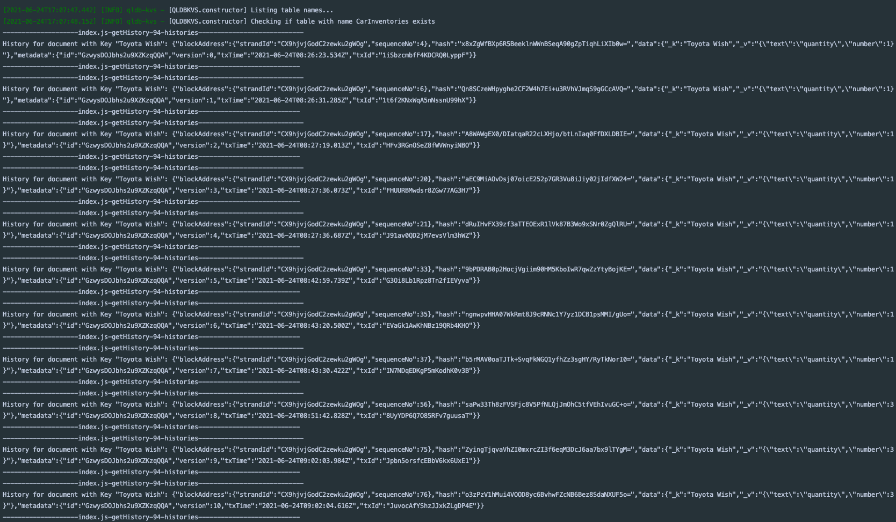

## Usage


## Reference

### Set and retrieve values

```js

   // Creating table
    const qldbKVS = await createQLDBLedger(true)

    //Insert records
    const response = await qldbKVS.setValue(DOC_OBJECT_KEY1, DOC_OBJECT_VALUE1)
    const responses = await qldbKVS.setValues([DOC_OBJECT_KEY1, DOC_OBJECT_KEY2], [DOC_OBJECT_VALUE1, DOC_OBJECT_VALUE2])

    //Get records
    await qldbKVS.getValue(DOC_OBJECT_KEY1);
    await qldbKVS.getValues([DOC_OBJECT_KEY1, DOC_OBJECT_KEY2]);
```


### verify record
```js
const metadata = await qldbKVS.getMetadata(DOC_OBJECT_KEY2);
await qldbKVS.verifyLedgerMetadata(metadata)
```


### Get history
```js
const qldbKVS = await createQLDBLedger(true)
await qldbKVS.getHistory(DOC_OBJECT_KEY1)
```

